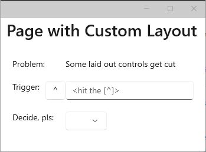
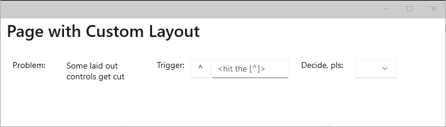
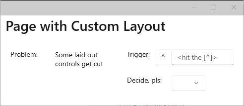
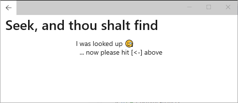
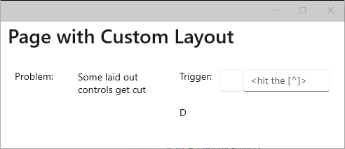
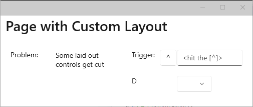
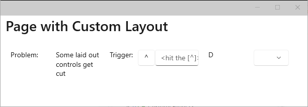
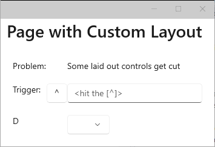

# MauiLayoutIssue
Repro of .NET MAUI issue, https://github.com/dotnet/maui/issues/14348, with NavigationPage and
custom Layout Manager on Windows.

> **ISSUE**  
> *Using NavigationPage to push and pop pages doesn't combine with a custom layout manager on
> Windows.*
> 
> Debugging using Visual Studio reveals that
> - the problematic controls from the scenario below continue to have
> ```
>     _handler.PhysicalView.DesiredSize == {0,0}
> ```
> *after* the call to `view.Arrange`  in line 133 of [CustomLayout](CustomLayout.cs), whereas
> - for the well functioning controls (which means all controls before the push and pop of another
> `ContentPage`), the call to `view.Arrange` correctly updates `DesiredSize` of the physical view.
>
> This problem occurs on **Windows 10** and **Windows 11**, but *not* on **Android**.
> Haven't tried other platforms.

## Scenario

The present [CustomLayout](CustomLayout.cs) adapts the number of columns to the width of the page:

  





However, if you push another page, e.g., by clicking the [^]:



and then pop it again, you end up with some controls fully or partially not appearing:



> **Note that**:
> 
> The [^] `Button` looses its `Text`, the "Decide, pls:" `Label` is reduced to show
> only the first letter, while the `Picker` is completely gone.
> 

Resizing at that point only makes some controls reappear:



and some partially shown controls (is it always `Label` controls?) continue to be buggy no matter how much resizing is done:





> **About Microsoft Visual Studio**
> 
> Microsoft Visual Studio Community 2022
> Version 17.6.0 Preview 2.0
> VisualStudio.17.Preview/17.6.0-pre.2.0+33513.286
> Microsoft .NET Framework
> Version 4.8.04084
> 
> Installed Version: Community
> 
> Visual C++ 2022   00482-90000-00000-AA290
> Microsoft Visual C++ 2022
> 
> ASP.NET and Web Tools   17.6.204.15292
> ASP.NET and Web Tools
> 
> Azure App Service Tools v3.0.0   17.6.204.15292
> Azure App Service Tools v3.0.0
> 
> Azure Functions and Web Jobs Tools   17.6.204.15292
> Azure Functions and Web Jobs Tools
> 
> C# Tools   4.6.0-2.23151.17+1314d090671dc1a1500c5303c4b5ae9150f40d98
> C# components used in the IDE. Depending on your project type and settings, a different > version of the compiler may be used.
> 
> Common Azure Tools   1.10
> Provides common services for use by Azure Mobile Services and Microsoft Azure Tools.
> 
> Extensibility Message Bus   1.4.3 (main@2a4517a)
> Provides common messaging-based MEF services for loosely coupled Visual Studio extension > components communication and integration.
> 
> Microsoft JVM Debugger   1.0
> Provides support for connecting the Visual Studio debugger to JDWP compatible Java Virtual > Machines
> 
> Mono Debugging for Visual Studio   17.6.8 (b2de728)
> Support for debugging Mono processes with Visual Studio.
> 
> NuGet Package Manager   6.6.0
> NuGet Package Manager in Visual Studio. For more information about NuGet, visit https://> docs.nuget.org/
> 
> Razor (ASP.NET Core)   17.5.2.2315304+47a4b09393e3f48a7c47277d13e593bda511dfef
> Provides languages services for ASP.NET Core Razor.
> 
> SQL Server Data Tools   17.2.40306.0
> Microsoft SQL Server Data Tools
> 
> TypeScript Tools   17.0.20302.2003
> TypeScript Tools for Microsoft Visual Studio
> 
> Visual Basic Tools   4.6.0-2.23151.17+1314d090671dc1a1500c5303c4b5ae9150f40d98
> Visual Basic components used in the IDE. Depending on your project type and settings, a > different version of the compiler may be used.
> 
> Visual F# Tools   17.6.0-beta.23126.1+4de2393866be1be6fa35af544c6f25a10af5ab3d
> Microsoft Visual F# Tools
> 
> Visual Studio IntelliCode   2.2
> AI-assisted development for Visual Studio.
> 
> VisualStudio.DeviceLog   1.0
> Information about my package
> 
> VisualStudio.Mac   1.0
> Mac Extension for Visual Studio
> 
> VSPackage Extension   1.0
> VSPackage Visual Studio Extension Detailed Info
> 
> Xamarin   17.6.0.96 (main@020b354)
> Visual Studio extension to enable development for Xamarin.iOS and Xamarin.Android.
> 
> Xamarin Designer   17.6.2.2 (remotes/origin/d17-6@dbce9e1ce9)
> Visual Studio extension to enable Xamarin Designer tools in Visual Studio.
> 
> Xamarin.Android SDK   13.2.0.6 (d17-5/a200af1)
> Xamarin.Android Reference Assemblies and MSBuild support.
>     Mono: 6dd9def
>     Java.Interop: xamarin/java.interop/d17-5@149d70fe
>     SQLite: xamarin/sqlite/3.40.1@68c69d8
>     Xamarin.Android Tools: xamarin/xamarin-android-tools/d17-5@9f02d77
> 
